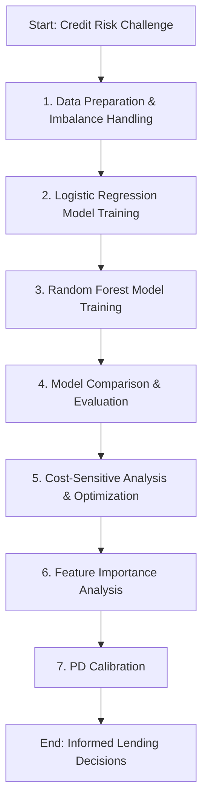

id: 698f741a53049d8a753b8dbd_documentation
summary: Lab 5: Credit Default Classification Documentation
feedback link: https://docs.google.com/forms/d/e/1FAIpQLSfWkOK-in_bMMoHSZfcIvAeO58PAH9wrDqcxnJABHaxiDqhSA/viewform?usp=sf_link
environments: Web
status: Published
# QuLab: Credit Default Classification for Financial Professionals

## 0. Introduction: Optimizing Loan Risk Management at CapitalFlow Bank
Duration: 05:00

Welcome to this comprehensive codelab on Credit Default Classification, designed to guide financial professionals through a practical application of machine learning in risk management. This codelab is built around the "QuLab: Lab 5: Credit Default Classification" Streamlit application, which simulates a real-world scenario for a Senior Credit Risk Analyst named Alex Chen at CapitalFlow Bank.

<aside class="positive">
<b>Goal:</b> This codelab aims to provide a deep understanding of developing, evaluating, and deploying credit default prediction models, explicitly addressing financial industry challenges like class imbalance and asymmetric misclassification costs. You will learn not only how to build models but also how to interpret their results in a financially meaningful and regulatory-compliant manner.
</aside>

**Scenario Overview:** Alex is tasked with improving CapitalFlow Bank's credit default prediction models, which are crucial for loan origination, risk-based pricing, and regulatory capital requirements (e.g., Basel III/IV, IFRS 9). The project involves comparing a traditional Logistic Regression scorecard with a more flexible Random Forest classifier to estimate the Probability of Default (PD) for new loan applicants. Key challenges include:

*   **Class Imbalance:** Defaults are rare events, requiring specialized handling.
*   **Asymmetric Costs:** The financial cost of approving a bad loan (False Negative) is significantly higher than rejecting a good loan (False Positive).
*   **Model Interpretability:** Balancing predictive power with the need for transparent, explainable models for stakeholders and regulators.
*   **PD Calibration:** Ensuring predicted probabilities accurately reflect observed default rates for financial provisioning.

This codelab will walk you through Alex's workflow, covering data preparation, model training, rigorous evaluation using financial metrics, cost-sensitive optimization, feature importance analysis, and Probability of Default (PD) calibration.

### Application Workflow Overview

The Streamlit application and this codelab follow a structured, sequential workflow, mirroring a typical machine learning project lifecycle in a financial context.



Let's begin by setting up our environment and understanding the initial data processing.

## 1. Data Preparation & Imbalance Handling
Duration: 05:00

In this initial phase, Alex transforms raw loan data into a clean, structured dataset suitable for modeling. This involves defining the binary target variable (default or not), selecting pertinent features, and preprocessing them. A critical step is recognizing and addressing the inherent class imbalance in credit data, where defaults are much less frequent than fully paid loans. Furthermore, Alex must be vigilant about potential data leakage, particularly concerning features like `int_rate` which can inadvertently reveal future information.

The target variable, $y_i$, for each loan $i$, is defined as:
$$ y_i = \begin{cases} 1 & \text{if loan } i \text{ defaulted (charged off or defaulted)} \\ 0 & \text{if loan } i \text{ was fully repaid} \end{cases} $$
where $y_i$ is the binary target variable for loan $i$.

<aside class="negative">
⚠️ <b>Practitioner Warning: Data Leakage Risk</b>
The feature <code>int_rate</code> is set by LendingClub based on their own risk assessment. Including it as a predictor creates information leakage—the rate already encodes the platform's view of default risk. For this exercise, we include it with a discussion note, as it teaches the leakage concept. In production, consider excluding it or treating it as a target for a secondary model.
</aside>

**Action:** To initiate this step in the Streamlit application, navigate to **"1. Data Preparation & Imbalance Handling"** using the sidebar, and then click the **"Load and Preprocess Data"** button.

The application executes the `load_and_preprocess_data()` function (from the `source.py` module), which performs the following key tasks:

1.  Loads raw data from a CSV file.
2.  Filters out irrelevant loan statuses (e.g., 'Current', 'In Grace Period').
3.  Defines the `default` target variable.
4.  Performs feature engineering (e.g., calculating `loan_to_income_ratio`, `months_since_issue`).
5.  Handles categorical features using one-hot encoding.
6.  Splits data into training and testing sets.
7.  Scales numerical features using `StandardScaler`.

```python
# Simplified representation of the function call in source.py
# In a real setup, 'source.py' would contain the actual implementation
from sklearn.model_selection import train_test_split
from sklearn.preprocessing import StandardScaler
import pandas as pd
import numpy as np

def load_and_preprocess_data():
    # Load data
    df = pd.read_csv('loan_data.csv') # Assume loan_data.csv exists
    
    # Filter for relevant statuses
    df_filtered = df[df['loan_status'].isin(['Charged Off', 'Default', 'Fully Paid'])].copy()
    
    # Define target variable
    df_filtered['default'] = df_filtered['loan_status'].apply(lambda x: 1 if x in ['Charged Off', 'Default'] else 0)
    
    # Feature selection (example features)
    features = ['loan_amnt', 'term', 'int_rate', 'installment', 'grade', 'emp_length',
                'home_ownership', 'annual_inc', 'verification_status', 'dti',
                'delinq_2yrs', 'inq_last_6mths', 'pub_rec', 'revol_bal', 'revol_util',
                'total_acc', 'collections_12_mths_ex_med', 'open_acc']
    
    df_model = df_filtered[features + ['default']].dropna()
    
    # Categorical encoding (example)
    df_model = pd.get_dummies(df_model, columns=['term', 'grade', 'emp_length', 'home_ownership', 'verification_status'], drop_first=True)
    
    # Define X and y
    X = df_model.drop('default', axis=1)
    y = df_model['default']
    
    # Train-test split
    X_train, X_test, y_train, y_test = train_test_split(X, y, test_size=0.2, random_state=42, stratify=y)
    
    # Scale numerical features
    scaler = StandardScaler()
    numerical_cols = X.select_dtypes(include=np.number).columns
    X_train_sc = X_train.copy()
    X_test_sc = X_test.copy()
    X_train_sc[numerical_cols] = scaler.fit_transform(X_train[numerical_cols])
    X_test_sc[numerical_cols] = scaler.transform(X_test[numerical_cols])
    
    return X_train_sc, X_test_sc, y_train, y_test, X.columns.tolist(), df_model
```

After successful execution, the Streamlit app will display:

*   The initial default rate and dataset size.
*   The default rates and sizes for the training and testing sets.
*   A head (sample) of the processed data.

This output confirms that the data is loaded, cleaned, and ready for model training, with the class imbalance observed and stratified splits performed.

## 2. Logistic Regression Model
Duration: 07:00

Alex starts with Logistic Regression, a robust and widely accepted model in finance due to its interpretability and ease of regulatory compliance. The model estimates the probability of default for each loan applicant. The coefficients of the Logistic Regression model can be directly translated into odds ratios, offering a transparent understanding of how each feature influences the likelihood of default. Given the class imbalance, `class_weight='balanced'` is implemented to ensure the model doesn't simply favor the majority (non-default) class.

The Logistic Regression model uses a sigmoid function to map a linear combination of features to a probability:
$$ P(y_i = 1 | \mathbf{x}_i) = \sigma(\beta_0 + \mathbf{\beta}^T \mathbf{x}_i) = \frac{1}{1 + e^{-(\beta_0 + \mathbf{\beta}^T \mathbf{x}_i)}} $$
where $P(y_i = 1 | \mathbf{x}_i)$ is the probability of default for loan $i$, $\mathbf{x}_i$ is the vector of features for loan $i$, $\beta_0$ is the intercept, and $\mathbf{\beta}^T$ is the vector of coefficients.

The log-odds, or logit, interpretation is:
$$ \log\left(\frac{P(\text{default})}{1 - P(\text{default})}\right) = \beta_0 + \beta_1 x_1 + \beta_2 x_2 + \dots + \beta_p x_p $$
where $P(\text{default})$ is the probability of default, and $x_j$ are the individual features.

For each feature $j$, the odds ratio ($\text{OR}_j$) is derived from its coefficient $\beta_j$:
$$ \text{OR}_j = e^{\beta_j} $$
where $\text{OR}_j$ is the odds ratio for feature $j$, and $\beta_j$ is its coefficient. An odds ratio of 1.15, for example, means that for a one-unit increase in $x_j$ (holding other features constant), the odds of default are multiplied by 1.15, indicating a 15% increase in default odds.

The coefficients ($\mathbf{\beta}$) are estimated by maximizing the likelihood function, which is equivalent to minimizing the binary cross-entropy (or log loss):
$$ \mathcal{L}(\mathbf{\beta}) = \sum_{i=1}^N [y_i \log P(y_i=1|\mathbf{x}_i) + (1-y_i) \log(1 - P(y_i=1|\mathbf{x}_i))] $$
where $\mathcal{L}(\mathbf{\beta})$ is the likelihood function, $y_i$ is the actual outcome for loan $i$, and $P(y_i=1|\mathbf{x}_i)$ is the predicted probability of default.

**Action:** Navigate to **"2. Logistic Regression Model"** and click the **"Train Logistic Regression Model"** button.

This will execute the `train_logistic_regression()` function (from `source.py`).

```python
# Simplified representation of the function call
from sklearn.linear_model import LogisticRegression
import pandas as pd

def train_logistic_regression(X_train_sc, y_train, feature_cols):
    log_model = LogisticRegression(random_state=42, solver='liblinear', class_weight='balanced')
    log_model.fit(X_train_sc, y_train)
    y_prob_log = log_model.predict_proba(X_test_sc)[:, 1] # Assuming X_test_sc is globally available for prediction
    
    odds_ratio_df = pd.DataFrame({
        'Feature': feature_cols,
        'Coefficient': log_model.coef_[0],
        'Odds Ratio': np.exp(log_model.coef_[0])
    }).sort_values('Odds Ratio', ascending=False).reset_index(drop=True)
    
    return log_model, y_prob_log, odds_ratio_df
```

Upon completion, the application will display the **Logistic Regression Odds Ratio Table**, showing how each feature influences the likelihood of default.

## 3. Random Forest Model
Duration: 10:00

While Logistic Regression provides excellent interpretability, Alex wants to explore if a more complex model like Random Forest can capture non-linear relationships and intricate feature interactions that might improve predictive power. Random Forests are ensemble models that build multiple decision trees and average their predictions. To further tackle the class imbalance, Alex uses SMOTE (Synthetic Minority Over-sampling Technique) on the training data, generating synthetic samples of the minority class. Hyperparameter tuning with `GridSearchCV` ensures the Random Forest model is optimized for performance.

A Random Forest constructs $B$ decision trees. Each tree is trained on a bootstrap sample of the data, considering a random subset of $m \approx \sqrt{p}$ features at each split (where $p$ is the total number of features). The ensemble prediction for the probability of default given features $\mathbf{x}$ is:
$$ \hat{P}(\text{default} | \mathbf{x}) = \frac{1}{B} \sum_{b=1}^B \hat{P}_b(\text{default} | \mathbf{x}) $$
where $\hat{P}(\text{default} | \mathbf{x})$ is the ensemble predicted probability, $B$ is the number of trees, and $\hat{P}_b(\text{default} | \mathbf{x})$ is the prediction from tree $b$.

When `class_weight='balanced'` is used in tree-based models, the loss function (often Gini impurity or entropy) is modified such that the samples of the minority class (defaults) are given higher weight during tree construction. For a weighted loss function, the contribution of each sample $i$ to the total loss $\mathcal{L}_w$ is adjusted by its class weight $w_{y_i}$:
$$ \mathcal{L}_w(\mathbf{\beta}) = \sum_{i=1}^N w_{y_i} [y_i \log \hat{p}_i + (1 - y_i) \log(1 - \hat{p}_i)] $$
where $\mathcal{L}_w(\mathbf{\beta})$ is the weighted loss function, $w_{y_i}$ is the class weight for sample $i$, $y_i$ is the actual outcome, and $\hat{p}_i$ is the predicted probability.
For a dataset with 5% defaults, $w_1 \approx 10$ and $w_0 \approx 0.526$, effectively making each default sample contribute significantly more to the loss, forcing the model to 'pay attention' to the minority class.

**Action:** Navigate to **"3. Random Forest Model"** and click the **"Train Random Forest Model (with SMOTE & GridSearchCV)"** button.

This step involves `GridSearchCV` and SMOTE, which can take a considerable amount of time depending on the dataset size and hardware. The `train_random_forest()` function (from `source.py`) will be executed.

```python
# Simplified representation of the function call
from sklearn.ensemble import RandomForestClassifier
from imblearn.over_sampling import SMOTE
from imblearn.pipeline import Pipeline
from sklearn.model_selection import GridSearchCV

def train_random_forest(X_train_sc, y_train, X_test_sc, feature_cols):
    # Define the pipeline with SMOTE and RandomForestClassifier
    pipeline = Pipeline([
        ('smote', SMOTE(random_state=42)),
        ('rf', RandomForestClassifier(random_state=42, class_weight='balanced'))
    ])
    
    # Hyperparameter grid for GridSearchCV
    param_grid = {
        'rf__n_estimators': [100, 200],
        'rf__max_depth': [10, 20],
        'rf__min_samples_leaf': [5, 10]
    }
    
    # GridSearchCV
    grid_search = GridSearchCV(pipeline, param_grid, cv=3, scoring='roc_auc', n_jobs=-1, verbose=1)
    grid_search.fit(X_train_sc, y_train)
    
    best_rf_pipeline = grid_search.best_estimator_
    y_prob_rf = best_rf_pipeline.predict_proba(X_test_sc)[:, 1]
    
    return best_rf_pipeline.named_steps['rf'], y_prob_rf
```

Once the training is complete, the application will display the `Best Random Forest Parameters` and confirm that the model is ready for comparison.

## 4. Model Comparison & Evaluation
Duration: 08:00

Alex knows that 'accuracy' alone is a misleading metric for imbalanced credit default data. A model predicting 'no default' for all loans could achieve high accuracy but would miss all actual defaults, which is financially catastrophic. Instead, Alex focuses on credit-appropriate metrics: ROC-AUC, Precision-Recall curves, and the Kolmogorov-Smirnov (KS) statistic, which are crucial for assessing a model's ability to discriminate between good and bad loans, especially for the rare default events.

<aside class="negative">
⚠️ <b>Practitioner Warning: Accuracy is NOT a Primary Metric</b>
With a high non-default rate, a trivial 'predict all non-default' model achieves high accuracy but catches zero defaults. Reporting accuracy in a credit scoring context signals a fundamental misunderstanding. Always lead with AUC, KS, and the confusion matrix at a decision-relevant threshold.
</aside>

*   **ROC-AUC (Area Under the Receiver Operating Characteristic):** Measures the model's discrimination power. Probabilistic interpretation: the chance that a randomly selected default case is scored higher than a randomly selected non-default.
    $$ \text{AUC} = P(\hat{P}_{\text{default}} > \hat{P}_{\text{non-default}}) $$
    where $\text{AUC}$ is the Area Under the Curve, and $\hat{P}_{\text{default}}$ and $\hat{P}_{\text{non-default}}$ are the predicted probabilities for default and non-default cases respectively. An AUC of 0.5 is random, >0.70 is acceptable, >0.80 is strong for consumer credit.
*   **Gini Coefficient:** An industry-standard alternative to AUC, directly related by:
    $$ \text{Gini} = 2 \times \text{AUC} - 1 $$
    where $\text{Gini}$ is the Gini coefficient and $\text{AUC}$ is the Area Under the Curve.
*   **Precision-Recall Curve:** Particularly informative for imbalanced datasets, showing the trade-off between precision and recall at various thresholds.
*   **Kolmogorov-Smirnov (KS) Statistic:** Measures the maximum separation between the cumulative distribution functions (CDFs) of predicted probabilities for default and non-default classes.
    $$ \text{KS} = \max_t |F_1(t) - F_0(t)| $$
    where $\text{KS}$ is the Kolmogorov-Smirnov statistic, $F_1(t)$ is the CDF of predicted probabilities for defaults, and $F_0(t)$ is the CDF for non-defaults. A KS > 0.30 is generally considered acceptable.

**Action:** Navigate to **"4. Model Comparison & Evaluation"** and click the **"Calculate Performance Metrics (Default Threshold 0.5)"** button.

The application will use the `calculate_model_metrics()` and `plot_roc_pr_ks()` functions (from `source.py`) to generate the evaluation results.

```python
# Simplified representation of the function calls
from sklearn.metrics import roc_auc_score, f1_score, precision_score, recall_score, roc_curve, precision_recall_curve
import numpy as np
import matplotlib.pyplot as plt

def calculate_model_metrics(y_true, y_prob, threshold):
    y_pred = (y_prob >= threshold).astype(int)
    auc = roc_auc_score(y_true, y_prob)
    gini = 2 * auc - 1
    f1 = f1_score(y_true, y_pred)
    precision = precision_score(y_true, y_pred)
    recall = recall_score(y_true, y_pred)

    # KS Statistic calculation
    fpr, tpr, thresholds = roc_curve(y_true, y_prob)
    ks_statistic = np.max(tpr - fpr)
    
    return {'AUC': auc, 'Gini': gini, 'KS Statistic': ks_statistic, 
            'F1-score': f1, 'Precision': precision, 'Recall': recall}

def plot_roc_pr_ks(y_test, y_prob_log, y_prob_rf):
    fig, axes = plt.subplots(1, 3, figsize=(24, 6))

    # ROC Curve
    fpr_log, tpr_log, _ = roc_curve(y_test, y_prob_log)
    fpr_rf, tpr_rf, _ = roc_curve(y_test, y_prob_rf)
    axes[0].plot(fpr_log, tpr_log, label=f'Logistic Regression (AUC = {roc_auc_score(y_test, y_prob_log):.3f})')
    axes[0].plot(fpr_rf, tpr_rf, label=f'Random Forest (AUC = {roc_auc_score(y_test, y_prob_rf):.3f})')
    axes[0].plot([0, 1], [0, 1], 'k--', label='Random')
    axes[0].set_xlabel('False Positive Rate')
    axes[0].set_ylabel('True Positive Rate')
    axes[0].set_title('ROC Curve')
    axes[0].legend()

    # Precision-Recall Curve
    precision_log, recall_log, _ = precision_recall_curve(y_test, y_prob_log)
    precision_rf, recall_rf, _ = precision_recall_curve(y_test, y_prob_rf)
    axes[1].plot(recall_log, precision_log, label='Logistic Regression')
    axes[1].plot(recall_rf, precision_rf, label='Random Forest')
    axes[1].set_xlabel('Recall')
    axes[1].set_ylabel('Precision')
    axes[1].set_title('Precision-Recall Curve')
    axes[1].legend()

    # KS Plot
    def plot_ks(ax, y_true, y_prob, label):
        df_plot = pd.DataFrame({'true': y_true, 'prob': y_prob})
        df_plot = df_plot.sort_values('prob', ascending=False)
        
        cumulative_defaults = df_plot['true'].cumsum() / df_plot['true'].sum()
        cumulative_non_defaults = (1 - df_plot['true']).cumsum() / (1 - df_plot['true']).sum()
        
        ks_value = np.max(np.abs(cumulative_defaults - cumulative_non_defaults))
        
        ax.plot(np.arange(len(df_plot)) / len(df_plot), cumulative_defaults, label='Cumulative Defaults')
        ax.plot(np.arange(len(df_plot)) / len(df_plot), cumulative_non_defaults, label='Cumulative Non-Defaults')
        ax.axvline(x=np.argmax(np.abs(cumulative_defaults - cumulative_non_defaults)) / len(df_plot), color='r', linestyle='--', label=f'KS Max ({ks_value:.3f})')
        ax.set_title(f'KS Curve: {label}')
        ax.legend()
        ax.set_xlabel('Population %')
        ax.set_ylabel('Cumulative %')

    plot_ks(axes[2], y_test, y_prob_log, 'Logistic Regression') # Only one KS plot for brevity in app
    # You might want to plot both or combine for comparison

    plt.tight_layout()
    return fig
```

The app will display a **Model Comparison Table** (at the default threshold of 0.5) and **Model Performance Curves** including ROC, Precision-Recall, and KS plots, allowing for a visual comparison of the models.

## 5. Cost-Sensitive Analysis & Optimization
Duration: 12:00

This is where Alex translates model probabilities into tangible financial decisions for CapitalFlow Bank. The cost of a False Negative (approving a loan that defaults) is significantly higher than a False Positive (rejecting a loan that would have been repaid). Alex defines these asymmetric costs, calculates the Expected Total Cost across various probability thresholds, and identifies the optimal threshold that minimizes overall financial losses. This cost-sensitive approach is vital for maximizing bank profitability and managing risk effectively.

The Expected Total Cost for a given threshold is calculated as:
$$ C_{\text{total}} = \text{FN} \times (\text{LGD} \times \text{EAD}) + \text{FP} \times C_{\text{opportunity}} $$
Where:
*   $\text{FN}$ = Number of False Negatives (actual defaults predicted as non-defaults)
*   $\text{FP}$ = Number of False Positives (actual non-defaults predicted as defaults)
*   $\text{LGD}$ = Loss Given Default (percentage of exposure lost if default occurs).
*   $\text{EAD}$ = Exposure at Default (the outstanding loan amount at the time of default). For simplicity, we assume this is the `avg_loan_amount`.
*   $C_{\text{opportunity}}$ = Opportunity cost of declining a good loan (e.g., lost interest margin).

**Cost Assumptions for CapitalFlow Bank (defaults can be adjusted using sliders in the app's sidebar):**
*   Average Loan Amount (`avg_loan_amount`): $15,000
*   Loss Given Default (`LGD`): 60%
*   Opportunity Cost Rate (`opportunity_cost_rate`): 3% (lost margin on a good loan)
Therefore:
*   `cost_fn` (Cost of a missed default) = `avg_loan_amount` $\times$ `LGD` = $15,000 \times 0.60 = $9,000
*   `cost_fp` (Cost of declining a good loan) = `avg_loan_amount` $\times$ `opportunity_cost_rate` = $15,000 \times 0.03 = $450

<aside class="info">
💡 <b>Key Insight: Optimal Threshold is Rarely 0.5</b>
In credit scoring, the cost of a missed default (FN: $9,000) far exceeds the cost of a declined good loan (FP: $450). The optimal threshold is typically much lower (e.g., 0.15-0.25). This 20:1 asymmetry in costs drives this shift—a critical concept for credit professionals.
</aside>

**Action:** Navigate to **"5. Cost-Sensitive Analysis & Optimization"**. You can adjust the "Average Loan Amount", "Loss Given Default (LGD)", and "Opportunity Cost Rate (%)" using the sliders in the sidebar. Then, click the **"Perform Cost-Sensitive Optimization"** button.

The application will execute the `perform_cost_sensitive_analysis()` and `plot_cost_curve()`, `plot_financial_confusion_matrix()` functions (from `source.py`).

```python
# Simplified representation of the functions
from sklearn.metrics import confusion_matrix
import matplotlib.pyplot as plt
import seaborn as sns

def perform_cost_sensitive_analysis(y_true, y_prob_log, y_prob_rf, avg_loan_amount, lgd, opp_cost_rate):
    cost_fn = avg_loan_amount * lgd
    cost_fp = avg_loan_amount * opp_cost_rate
    
    thresholds = np.linspace(0.01, 0.99, 100)
    costs_log = []
    costs_rf = []

    for t in thresholds:
        # For Logistic Regression
        y_pred_log = (y_prob_log >= t).astype(int)
        tn, fp, fn, tp = confusion_matrix(y_true, y_pred_log).ravel()
        costs_log.append(fn * cost_fn + fp * cost_fp)

        # For Random Forest
        y_pred_rf = (y_prob_rf >= t).astype(int)
        tn, fp, fn, tp = confusion_matrix(y_true, y_pred_rf).ravel()
        costs_rf.append(fn * cost_fn + fp * cost_fp)

    opt_t_log = thresholds[np.argmin(costs_log)]
    min_cost_log = np.min(costs_log)
    opt_t_rf = thresholds[np.argmin(costs_rf)]
    min_cost_rf = np.min(costs_rf)
    
    return opt_t_log, min_cost_log, opt_t_rf, min_cost_rf, cost_fn, cost_fp, (thresholds, costs_log, costs_rf)

def plot_cost_curve(thresholds, costs_log, costs_rf, opt_t_log, min_cost_log, opt_t_rf, min_cost_rf):
    fig, ax = plt.subplots(figsize=(10, 6))
    ax.plot(thresholds, costs_log, label='Logistic Regression')
    ax.plot(thresholds, costs_rf, label='Random Forest')
    
    ax.axvline(opt_t_log, color='blue', linestyle='--', label=f'LR Optimal Th: {opt_t_log:.2f}')
    ax.axvline(opt_t_rf, color='orange', linestyle='--', label=f'RF Optimal Th: {opt_t_rf:.2f}')
    ax.scatter(opt_t_log, min_cost_log, color='blue', marker='o', s=100)
    ax.scatter(opt_t_rf, min_cost_rf, color='orange', marker='o', s=100)

    ax.set_xlabel('Probability Threshold')
    ax.set_ylabel('Total Expected Cost')
    ax.set_title('Expected Total Cost vs. Probability Threshold')
    ax.legend()
    ax.grid(True)
    return fig

def plot_financial_confusion_matrix(y_true, y_prob, threshold, cost_fn, cost_fp, model_name):
    y_pred = (y_prob >= threshold).astype(int)
    cm = confusion_matrix(y_true, y_pred)
    tn, fp, fn, tp = cm.ravel()

    # Calculate financial costs
    total_fn_cost = fn * cost_fn
    total_fp_cost = fp * cost_fp
    total_cost = total_fn_cost + total_fp_cost

    fig, ax = plt.subplots(figsize=(8, 6))
    sns.heatmap(cm, annot=True, fmt='d', cmap='Blues', cbar=False, ax=ax,
                xticklabels=['Predicted Non-Default', 'Predicted Default'],
                yticklabels=['Actual Non-Default', 'Actual Default'])
    ax.set_title(f'Confusion Matrix for {model_name} (Th={threshold:.2f})\n'
                 f'False Negative Cost: ${total_fn_cost:,.0f}\n'
                 f'False Positive Cost: ${total_fp_cost:,.0f}\n'
                 f'Total Cost: ${total_cost:,.0f}')
    ax.set_ylabel('Actual')
    ax.set_xlabel('Predicted')
    
    return fig
```

After performing the analysis, the app will display:

*   **Optimal Classification Thresholds** for both models and their respective minimum costs.
*   A **Cost Curve Analysis** plot showing how total expected cost changes with different thresholds.
*   **Financial Impact of Model Decisions (Confusion Matrices)** for each model, highlighting the number of FN/FP and their associated costs.
*   An updated **Model Comparison Table** with metrics calculated at the newly found optimal thresholds.

## 6. Feature Importance
Duration: 08:00

To gain deeper insights into credit risk, Alex needs to understand which factors are most influential in predicting default. This involves extracting and comparing feature importance from both the Logistic Regression and Random Forest models. While Logistic Regression provides clear coefficient magnitudes (and odds ratios), Random Forest uses Gini impurity to rank features. This comparison helps CapitalFlow Bank understand different perspectives on risk drivers and informs targeted interventions. It also highlights the trade-off between model interpretability and predictive power, a key consideration for regulatory transparency.

<aside class="info">
📚 <b>Discussion Point: Explainability-Accuracy Trade-off</b>
Logistic Regression is highly transparent (coefficients directly explain impact), which is often a regulatory requirement. Random Forests, while potentially more accurate, are less inherently interpretable and may require additional XAI tools (like SHAP/LIME) for individual-level explanations.
</aside>

<aside class="info">
📊 <b>Discussion Point: AUC Gap Narrows with Feature Engineering</b>
Much of the Random Forest's advantage comes from automatically capturing non-linearities and interactions. However, if an analyst manually engineers interaction terms and non-linear transforms for the Logistic Regression model, the AUC gap often shrinks, demonstrating the value of domain expertise in feature engineering.
</aside>

**Action:** Navigate to **"6. Feature Importance"** and click the **"Analyze Feature Importance"** button.

This will trigger the `analyze_feature_importance()` and `plot_feature_importance_bars()`, `plot_predicted_pd_distributions()` functions (from `source.py`).

```python
# Simplified representation of the functions
import pandas as pd
import numpy as np
import matplotlib.pyplot as plt
import seaborn as sns

def analyze_feature_importance(log_model, best_rf, feature_cols):
    # Logistic Regression Importance (Absolute Coefficients)
    log_importance_df = pd.DataFrame({
        'Feature': feature_cols,
        'Importance': np.abs(log_model.coef_[0])
    }).sort_values('Importance', ascending=False).reset_index(drop=True)
    log_importance_df['Rank'] = log_importance_df.index + 1

    # Random Forest Importance (Gini Importance)
    rf_importance_df = pd.DataFrame({
        'Feature': feature_cols,
        'Importance': best_rf.feature_importances_
    }).sort_values('Importance', ascending=False).reset_index(drop=True)
    rf_importance_df['Rank'] = rf_importance_df.index + 1

    # Combine for comparison
    combined_importance_df = pd.merge(
        log_importance_df.rename(columns={'Rank': 'LogReg Rank', 'Importance': 'LogReg |Coef|'}),
        rf_importance_df.rename(columns={'Rank': 'RF Rank', 'Importance': 'RF Importance'}),
        on='Feature',
        how='outer'
    ).sort_values('RF Importance', ascending=False).fillna(0) # Fill NA if features differ
    
    return combined_importance_df, log_importance_df, rf_importance_df

def plot_feature_importance_bars(log_importance_df, rf_importance_df, feature_cols):
    fig, axes = plt.subplots(1, 2, figsize=(18, 8))

    # Logistic Regression
    sns.barplot(x='Importance', y='Feature', data=log_importance_df.head(15), ax=axes[0], palette='viridis')
    axes[0].set_title('Logistic Regression Feature Importance (Absolute Coefficients)')
    axes[0].set_xlabel('Absolute Coefficient Value')
    axes[0].set_ylabel('')

    # Random Forest
    sns.barplot(x='Importance', y='Feature', data=rf_importance_df.head(15), ax=axes[1], palette='magma')
    axes[1].set_title('Random Forest Feature Importance (Gini Importance)')
    axes[1].set_xlabel('Gini Importance')
    axes[1].set_ylabel('')

    plt.tight_layout()
    return fig

def plot_predicted_pd_distributions(y_true, y_prob_log, y_prob_rf):
    fig_lr, ax_lr = plt.subplots(figsize=(10, 6))
    sns.histplot(y_prob_log[y_true == 0], color='green', kde=True, stat='density', label='Non-Default', ax=ax_lr)
    sns.histplot(y_prob_log[y_true == 1], color='red', kde=True, stat='density', label='Default', ax=ax_lr)
    ax_lr.set_title('Logistic Regression PD Distribution')
    ax_lr.set_xlabel('Predicted Probability of Default (PD)')
    ax_lr.legend()
    
    fig_rf, ax_rf = plt.subplots(figsize=(10, 6))
    sns.histplot(y_prob_rf[y_true == 0], color='green', kde=True, stat='density', label='Non-Default', ax=ax_rf)
    sns.histplot(y_prob_rf[y_true == 1], color='red', kde=True, stat='density', label='Default', ax=ax_rf)
    ax_rf.set_title('Random Forest PD Distribution')
    ax_rf.set_xlabel('Predicted Probability of Default (PD)')
    ax_rf.legend()

    return fig_lr, fig_rf
```

The application will display:

*   A **Feature Importance Comparison Table** combining ranks and importance scores from both models.
*   **Feature Importance Bar Charts** for a visual comparison of the top influential features.
*   **Predicted Probability of Default (PD) Distributions** for both models, showing how well they separate default and non-default cases.

## 7. PD Calibration
Duration: 07:00

For CapitalFlow Bank, it's not enough for a model to simply rank borrowers by risk; the predicted probabilities of default (PDs) must also be well-calibrated. This means that if a model predicts a 10% PD, approximately 10% of those borrowers should actually default. Well-calibrated PDs are essential for accurate risk-based pricing, regulatory provisioning (e.g., IFRS 9 Expected Credit Loss calculations), and portfolio stress testing. Alex uses calibration curves to assess how closely the predicted PDs align with observed default rates.

A calibration curve (also known as a reliability diagram) plots the mean predicted probability for a given bin against the fraction of positive outcomes (observed default rate) in that bin. A perfectly calibrated model would have its points fall along the diagonal line $y=x$.

<aside class="info">
💰 <b>Discussion Point: Why Probability Calibration Matters</b>
AUC measures ranking quality, not calibration. For accurate risk-based pricing (rate based on PD) and provisioning (ECL = PD × LGD × EAD), well-calibrated probabilities are essential. Isotonic regression or Platt scaling can be applied to improve calibration if needed.
</aside>

**Action:** Navigate to **"7. PD Calibration"** and click the **"Assess and Calibrate PDs"** button.

This will execute the `perform_pd_calibration()` and `plot_calibration_curves()` functions (from `source.py`). The `perform_pd_calibration` function calculates Brier scores and also uses `CalibratedClassifierCV` with `method='isotonic'` to calibrate the Random Forest model's probabilities.

```python
# Simplified representation of the functions
from sklearn.calibration import CalibratedClassifierCV, calibration_curve
from sklearn.metrics import brier_score_loss
import matplotlib.pyplot as plt

def perform_pd_calibration(y_true, y_prob_log, y_prob_rf, best_rf_model, X_train_sc, y_train, X_test_sc):
    # Calculate Brier Scores
    brier_log = brier_score_loss(y_true, y_prob_log)
    brier_rf = brier_score_loss(y_true, y_prob_rf)

    # Calibrate Random Forest
    calibrated_rf = CalibratedClassifierCV(best_rf_model, method='isotonic', cv='prefit')
    calibrated_rf.fit(X_train_sc, y_train) # Use original training data for calibration fitting
    y_prob_rf_calibrated = calibrated_rf.predict_proba(X_test_sc)[:, 1]
    
    brier_rf_calibrated = brier_score_loss(y_true, y_prob_rf_calibrated)

    return y_prob_rf_calibrated, brier_log, brier_rf, brier_rf_calibrated

def plot_calibration_curves(y_true, y_prob_log, y_prob_rf, y_prob_rf_calibrated):
    fig_uncal, ax_uncal = plt.subplots(figsize=(10, 6))
    fraction_of_positives_log, mean_predicted_value_log = calibration_curve(y_true, y_prob_log, n_bins=10)
    fraction_of_positives_rf, mean_predicted_value_rf = calibration_curve(y_true, y_prob_rf, n_bins=10)
    
    ax_uncal.plot([0, 1], [0, 1], 'k:', label='Perfectly calibrated')
    ax_uncal.plot(mean_predicted_value_log, fraction_of_positives_log, 's-', label='Logistic Regression')
    ax_uncal.plot(mean_predicted_value_rf, fraction_of_positives_rf, 's-', label='Random Forest (Uncalibrated)')
    ax_uncal.set_ylabel('Fraction of positives')
    ax_uncal.set_xlabel('Mean predicted value')
    ax_uncal.set_title('Calibration Curves (Uncalibrated RF)')
    ax_uncal.legend(loc='lower right')

    fig_cal, ax_cal = plt.subplots(figsize=(10, 6))
    fraction_of_positives_rf_cal, mean_predicted_value_rf_cal = calibration_curve(y_true, y_prob_rf_calibrated, n_bins=10)
    
    ax_cal.plot([0, 1], [0, 1], 'k:', label='Perfectly calibrated')
    ax_cal.plot(mean_predicted_value_log, fraction_of_positives_log, 's-', label='Logistic Regression') # Compare with LR as baseline
    ax_cal.plot(mean_predicted_value_rf_cal, fraction_of_positives_rf_cal, 's-', label='Random Forest (Calibrated)')
    ax_cal.set_ylabel('Fraction of positives')
    ax_cal.set_xlabel('Mean predicted value')
    ax_cal.set_title('Calibration Curves (Calibrated RF)')
    ax_cal.legend(loc='lower right')

    return fig_uncal, fig_cal
```

The application will display:

*   **Brier Scores** for Logistic Regression, uncalibrated Random Forest, and calibrated Random Forest. A lower Brier score indicates better calibration.
*   **Calibration Curves** that visually assess how well the predicted PDs align with observed default rates, including a comparison of the uncalibrated and calibrated Random Forest models.

This concludes the comprehensive guide to credit default classification for financial professionals using the QuLab Streamlit application. You have now walked through a full end-to-end workflow, from data preparation to advanced model evaluation and financial optimization, gaining critical insights into building robust and responsible credit risk models.
